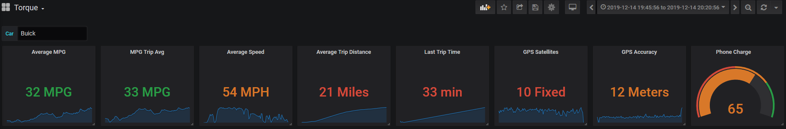
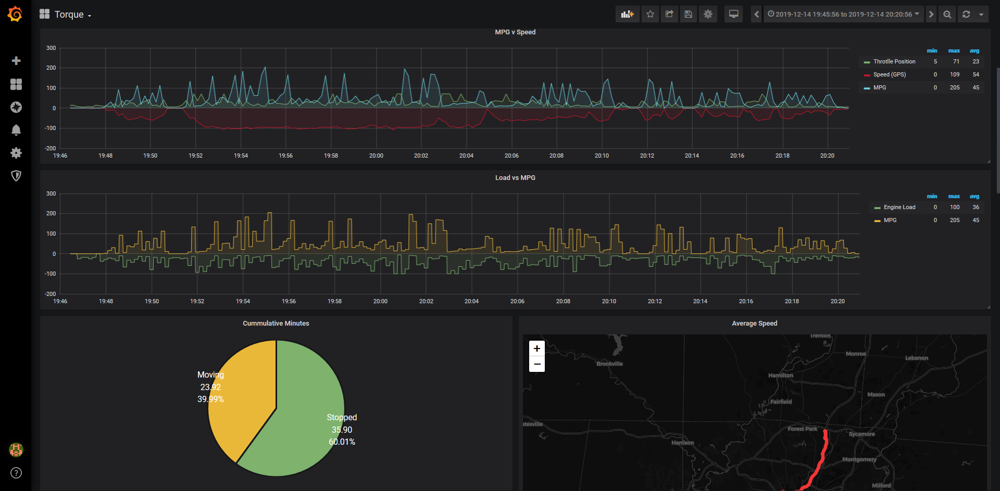
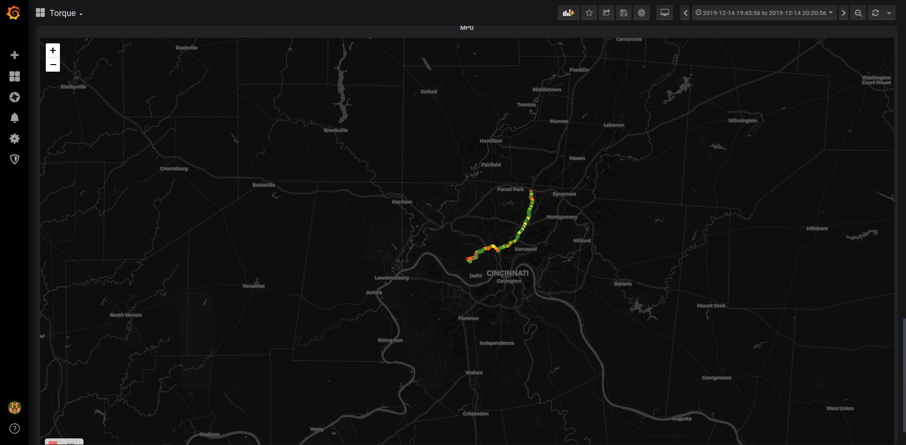

# Torque-Grafana-Dashboard
Grafana Dashboard for Torque App Stats (Android, ODBII) - plot, pivot and display your

Using seanauff's wonderful Node Red endpoint to push the data from Torque -> Node Red -> MQTT and into Influx/Grafana

https://github.com/seanauff/node-red-torque

# Requires;

1. Torque Pro App for Android: https://play.google.com/store/apps/details?id=org.prowl.torque&hl=en_US
   1. ODBII Bluetooth connector (Amazon should have one for <$10)
1. Node Red: https://github.com/node-red
1. Node-Red-Torque: https://github.com/seanauff/node-red-torque
1. MQTT (Personally using Mosquitto) https://mosquitto.org/
1. Telegraf (Using MQTT Collector) https://www.influxdata.com/time-series-platform/telegraf/
1. InfluxDB https://www.influxdata.com/
1. Grafana https://grafana.com/
   1. World Map Plugin for Grafana https://grafana.com/grafana/plugins/grafana-worldmap-panel/installation
   1. Pie Chart Plugin for Grafana https://grafana.com/grafana/plugins/grafana-piechart-panel
